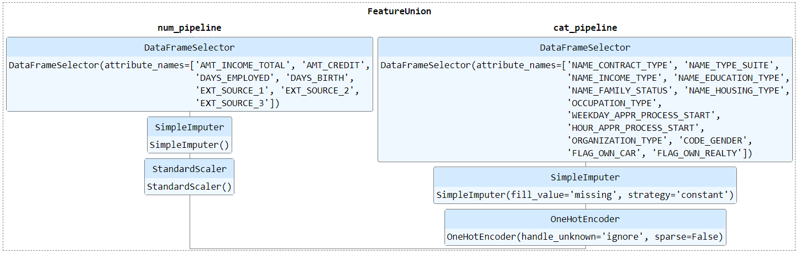

# Phase 1

---

One of the most fundamental and necessary parts of Machine Learning is data
analysis. Building Machine Learning Models is useless unless you comprehend the
data. We understand that Feature Engineering is at the heart of every Machine
Learning model, and that if we can't make sense of the data, we won't be able to
build the explanatory features that our models will need for categorization.
Exploratory Data Analysis is the process of analyzing data to uncover patterns,
behaviors, connections, and anomalies, as well as testing hypotheses and
generating summaries using statistical and graphical tools.

## Introduction:

---

***In this first phase of the research, we downloaded data from Kaggle. On the
given datasets, a few EDA approaches are used. This has been useful in
determining relevant attributes and determining missing values for each
attribute. We did basic feature engineering by exploiting EDA findings.***

## Transformers and feature engineering

All the category features for Feature Engineering were encoded in a single
pass. Pipelines are constructed for all secondary tables. Using a pipeline, the
aggregated data is integrated in the main table. The numerical and categorical
pipelines are specified as illustrated.

## Discussion

---

We tried and obtained some deeper understanding about the datasets and their
relationships throughout this phase. The EDA approach has been beneficial in
learning more about the correlations between various aspects. We created a basic
model in which some features are used after going through the pipeline.

## Phase 2 Strategy

---

We will concentrate on feature engineering, such as developing RFM features (
Recency, Frequency, and Monetary value) and establishing a multi-layer
perception (MLP) model in PyTorch.
