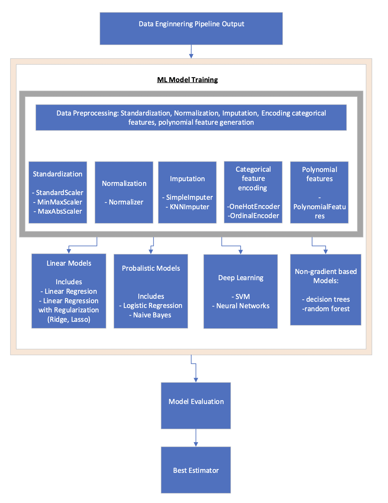

# Phase 2

---

In Phase 1 of our HCDR project, we developed a baseline model that was
insufficiently accurate for prediction. So, in phase 2, we refined our model by
employing a variety of strategies.

## Introduction:

---

***We concentrated on feature engineering and
hyperparameter optimization throughout Phase 2 of our project. In addition, we
have focused on feature selection, feature importance analysis, and ensemble
approaches.***

First, we performed data aggregation by building pipelines for all
secondary tables. Using a pipeline, the aggregated data is integrated into the
main table. This procedure includes imputation, scaling, and normalization. For
feature transformation, a class base feature transformer is employed.

The num pipeline and cat pipeline are combined using FeatureUnion. A series of
experiments are carried out in order to identify the most important features.
Finally, we used gridsearch to tune our models' hyper parameters. In this step,
we used decision trees, random forests, and XGBoost models. Gridsearch on model
parameters determines the optimal model.

## Discussion

---

During this phase, we worked on feature engineering and hyperparameter tuning.
We also tried Decision Tree, and Random Forest, and XGBoost to boost our scores. The
best model we have is XGBoost, which has a train accuracy of 0.8771 and a test
accuracy of 0.8132 after resampling.

## Phase 3 Strategy

---

+ Creating an MLP in Pytorch for default loan classification. 
+ Creating a regression model in Pytorch with at least one target value corresponding to,
say, the length of time or percentage of repayment period before the borrower
defaults.
+ Create a multi-headed load default system in PyTorch utilizing the OOP API and
a combined loss function.
