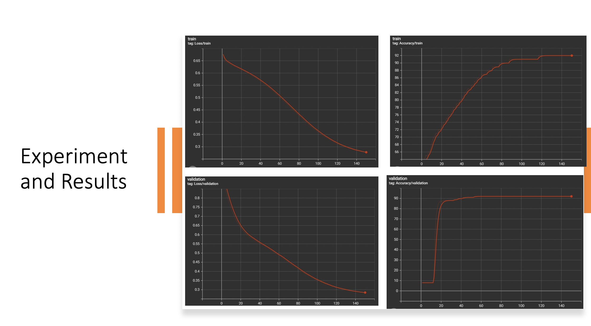

# Phase 3

---

In PyTorch, create a multi-layer perception (MLP) model for loan default
classification; using Tensorboard to visualize training outcomes in real time

## Introduction:

---

***Neural Network Taxonomy: Three Layers ( 157 input, 64 hidden and 1 output) It
employs the sigmoid activation function and There are three layers to regression (
157 input, 64 hidden and 1 output) The activation function ReLU is utilized.***

Hyper parameters:
- Loss function: Cross Entropy Loss (BCEwithLogitsLoss())
- Learning Rate: 0.001
- Optimizer: Adam
- Classification : 
  - Test CXE Loss: 0.29 |Accuracy - 92.0
  - Test CSE+MSE = 8.66

## Discussion

---

The project's purpose is to find those who can repay their loans. Our Machine
Learning model can predict whether an individual should be granted a loan
based on the applicant's prior applications, credit bureau history, payment
installments, and other significant variables such as sources of income, number
of family members, dependents, and so on. For target value 1, all machine
learning models trained with skewed data performed poorly. The model was
retrained using resampled data, as indicated by the confusion matrices, and
predictions for Target value 1 improved considerably. Because we employed a
lesser sample size to train the Deep Learning Model, it did not outperform
traditional machine learning models.

## Conclusion

---

In this phase 3, we used PyTorch to develop an MLP to decide whether the
candidate is loan eligible. With a test loss of 0.29, we achieved 92 percent
test accuracy. In addition, we built a multi-headed load default system that
combines both prior models' loss functions and designed an MLP model for
regression. Subsequently, we developed a pipeline that integrates all three
models.
