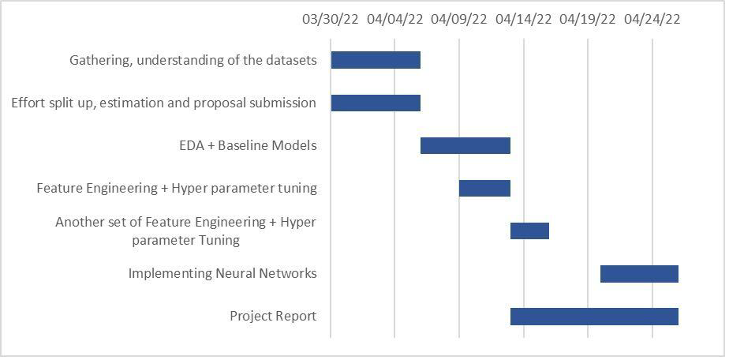

<div id="top"></div>

[![Contributors][contributors-shield]][contributors-url]
[![Forks][forks-shield]][forks-url]
[![Stargazers][stars-shield]][stars-url]
[![Issues][issues-shield]][issues-url]
[![MIT License][license-shield]][license-url]
[![LinkedIn][linkedin-shield]][linkedin-url]

[contributors-shield]: https://img.shields.io/github/contributors/kiran-karandikar/AML-Home-Credit-Default-Risk?style=for-the-badge

[contributors-url]: https://github.com/Kiran-Karandikar/AML-Home-Credit-Default-Risk/graphs/contributors

[forks-shield]: https://img.shields.io/github/forks/Kiran-Karandikar/AML-Home-Credit-Default-Risk?style=for-the-badge

[forks-url]: https://github.com/Kiran-Karandikar/AML-Home-Credit-Default-Risk/network

[stars-shield]: https://img.shields.io/github/stars/Kiran-Karandikar/AML-Home-Credit-Default-Risk?style=for-the-badge

[stars-url]: https://github.com/Kiran-Karandikar/AML-Home-Credit-Default-Risk/stargazers

[issues-shield]: https://img.shields.io/github/issues/Kiran-Karandikar/AML-Home-Credit-Default-Risk?style=for-the-badge

[issues-url]: https://github.com/Kiran-Karandikar/AML-Home-Credit-Default-Risk/issues

[license-shield]: https://img.shields.io/github/license/Kiran-Karandikar/AML-Home-Credit-Default-Risk?style=for-the-badge

[license-url]: https://github.com/Kiran-Karandikar/AML-Home-Credit-Default-Risk/blob/master/LICENSE

[linkedin-shield]: https://img.shields.io/badge/-LinkedIn-black.svg?style=for-the-badge&logo=linkedin&colorB=555

[linkedin-url]: https://linkedin.com/in/kiran-karandikar

---------


<!-- PROJECT LOGO -->
<br />
<div align="center">
<h3 align="center">AML-Home-Credit-Default-Risk</h3>
  <p align="center">
    Predicting how capable each applicant is of repaying a loan (Kaggle Challenge).    
    <br />    
    <a href="https://kiran-karandikar.github.io/AML-Home-Credit-Default-Risk"><strong>Preview</strong></a>
    <br />
    <a href="https://github.com/kiran-karandikar/AML-Home-Credit-Default-Risk"><strong>Explore the docs »</strong></a>
    <br />
    <br />
    <a href="https://github.com/kiran-karandikar/AML-Home-Credit-Default-Risk">View Demo</a>
    ·
    <a href="https://github.com/kiran-karandikar/AML-Home-Credit-Default-Risk/issues">Report Bug</a>
    ·
    <a href="https://github.com/kiran-karandikar/AML-Home-Credit-Default-Risk/issues">Request Feature</a>
  </p>
</div>

<!-- BADGES.MD Finish -->
<!-- BADGES.MD Finish -->

---


# Home-Credit-Default-Risk

Predicting how capable each applicant is of repaying a loan (**[Kaggle Challenge](https://www.kaggle.com/c/home-credit-default-risk)**).


# What is Home Credit Default Risk?

-Finding the Loan applicants who are very likely to repay the loan is an existential dilemma for any
Loan provider nowadays. Companies can prevent losses and make large profits this way. [Home
Credit](https://homecredit.ph/) provides straightforward, cheap, and quick loans for a variety of items such as home
appliances, cell phones, laptops, two-wheelers, and a variety of personal necessities. So, an ML
model can be used to predict who is capable of repaying a loan, given the applicant data, all
credits data from Credit Bureau, previous applications data from Home Credit and some more
data.

Data used in building this ML model is downloaded from Kaggle. Data engineering is done
using exploratory data analysis and feature engineering data. Building a model using various
machine learning techniques from linear regression to non-gradient-based models like decision
tress and random forest are used to estimate how competent each applicant is of repaying a
loan, with the goal of only approving loans for those who are likely to repay them can be an
effective method.

__This is a standard supervised classification task:__

+ Supervised: The labels are included in the training data and the goal is to train a model to learn to predict the labels from the features.

+ Classification: The label is a binary variable, 0 (will repay the loan on time), 1 (will have difficulty repaying the loan)

## Background on the dataset
Home Credit is a non-banking financial institution, founded in 1997 in the Czech Republic.

The company operates in 14 countries (including United States, Russia, Kazahstan, Belarus, China, India) and focuses on lending primarily to people with little or no credit history which will either not obtain loans or became victims of untrustworthly lenders.

Home Credit group has over 29 million customers, total assests of 21 billions Euro, over 160 millions loans, with the majority in Asia and and almost half of them in China (as of 19-05-2018).

While Home Credit is currently using various statistical and machine learning methods to make these predictions, they're challenging Kagglers to help them unlock the full potential of their data. Doing so will ensure that clients capable of repayment are not rejected and that loans are given with a principal, maturity, and repayment calendar that will empower their clients to be successful.

## Data files overview
There are 7 different sources of data:

* __application_train/application_test:__ the main training and testing data with information about each loan application at Home Credit. Every loan has its own row and is identified by the feature SK_ID_CURR. The training application data comes with the TARGET indicating __0: the loan was repaid__ or __1: the loan was not repaid__. The target variable defines if the client had payment difficulties meaning he/she had late payment more than X days on at least one of the first Y installments of the loan. Such case is marked as 1 while other all other cases as 0.
* __bureau:__ data concerning client's previous credits from other financial institutions. Each previous credit has its own row in bureau, but one loan in the application data can have multiple previous credits.
* __bureau_balance:__ monthly data about the previous credits in bureau. Each row is one month of a previous credit, and a single previous credit can have multiple rows, one for each month of the credit length.
* __previous_application:__ previous applications for loans at Home Credit of clients who have loans in the application data. Each current loan in the application data can have multiple previous loans. Each previous application has one row and is identified by the feature SK_ID_PREV.
* __POS_CASH_BALANCE:__ monthly data about previous point of sale or cash loans clients have had with Home Credit. Each row is one month of a previous point of sale or cash loan, and a single previous loan can have many rows.
* credit_card_balance: monthly data about previous credit cards clients have had with Home Credit. Each row is one month of a credit card balance, and a single credit card can have many rows.
* __installments_payment:__ payment history for previous loans at Home Credit. There is one row for every made payment and one row for every missed payment.

## Downloading the files via Kaggle API

Create a base directory:

```bash
DATA_DIR = "../../../Data/home-credit-default-risk"   #same level as course repo in the data directory
```

Please download the project data files and data dictionary and unzip them using either of the following approaches:

1. Click on the `Download` button on the following [Data Webpage](https://www.kaggle.com/c/home-credit-default-risk/data) and unzip the  zip file to the `BASE_DIR`
2. If you plan to use the Kaggle API, please use the following steps.

```shell
DATA_DIR = "../../../Data/home-credit-default-risk"   
!mkdir $DATA_DIR
!ls -l $DATA_DIR
! kaggle competitions download home-credit-default-risk -p $DATA_DIR
```

### Data Dictionary

As part of the data download comes a  Data Dictionary. It named `HomeCredit_columns_description.csv`


### Built With

* [Jupyter Notebook](http://jupyter.org/) - Project Jupiter exists to develop open-source software, open standards, and services for interactive computing across dozens of programming languages.
* [scikit-learn](http://scikit-learn.org/stable/) - Machine Learning in Python.
* [Pandas](https://pandas.pydata.org/) - pandas is an open-source, BSD-licensed library providing high-performance, easy-to-use data structures, and data analysis tools for the Python programming language.
* [Google Collab](https://colab.research.google.com) - a free Jupiter notebook environment that runs entirely in the cloud.

### Extras

> Designed with passion as part of the curriculum for the course CSCI P 556 - Applied Machine Learning in the spring of 2022 in four phases.


#### [Final Phase Preview](https://kiran-karandikar.github.io/AML-Home-Credit-Default-Risk/)

#### Project Timeline:


 
#### In association with:

- [Sathish Soundararajan](mailto:satsoun@iu.edu)
- [Yashwitha Reddy Pondugala](mailto:ypondug@iu.edu)
- [Rahul Gomathi Sankarakrishnan](mailto:rgomathi@iu.edu)

#####  References

Some material in project notebooks has been adopted
from [here](https://www.kaggle.com/willkoehrsen/start-here-a-gentle-introduction/notebook)

---


##### TODO: Predicting Loan Repayment with Automated Feature Engineering in Featuretools

* Feature engineering  [paper](https://dai.lids.mit.edu/wp-content/uploads/2017/10/DSAA_DSM_2015.pdf) and [this](https://www.analyticsvidhya.com/blog/2017/08/catboost-automated-categorical-data/)
* Feature engineering via [Featuretools library](https://github.com/Featuretools/predict-loan-repayment/blob/master/Automated%20Loan%20Repayment.ipynb) and [here](https://www.analyticsvidhya.com/blog/2018/08/guide-automated-feature-engineering-featuretools-python/)

###### License

This project is licensed under the MIT License - see the [LICENSE](LICENSE) file
for details


### Other projects

Check out the other stuff I've worked upon.

- ___AI/ML/Data Science___

  - **AML-Home-Credit-Default-Risk** : [Predicting how capable each applicant is of repaying a loan \(Kaggle Challenge\).](https://github.com/Kiran-Karandikar/AML-Home-Credit-Default-Risk)

  - **Exercise-performance-analysis** : [Prototype exercise volume prediction using machine learning models.](https://github.com/Kiran-Karandikar/Exercise-performance-analysis)

- ___Web Development___

  - **flask-app-template** : [Simple, reusable, minimalistic, configurable flask app.](https://github.com/Kiran-Karandikar/flask-app-template)

  - **flask-oauth2-wrike-api** : [A sample Flask app to authenticate with Wrike as a third-party OAuth2 provider.](https://github.com/Kiran-Karandikar/flask-oauth2-wrike-api)

> Section `Other projects` is auto-updated using [Github actions](https://github.com/features/actions). 
<!-- CONTACT -->
## Contact

- [Kiran Karandikar: khkarandikar at gmail dot com](mailto:khkarandikar@gmail.com)
